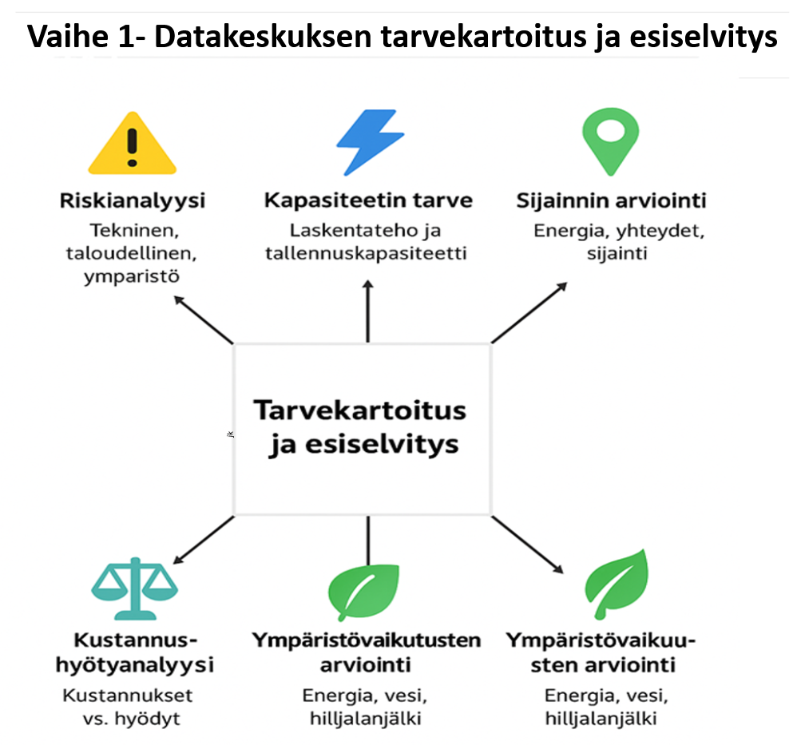
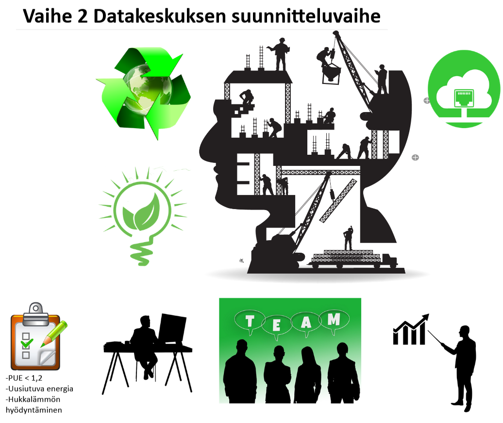
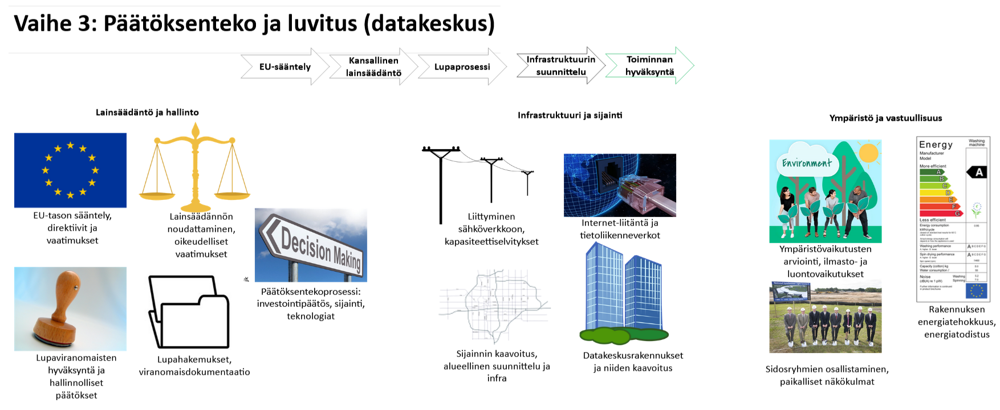
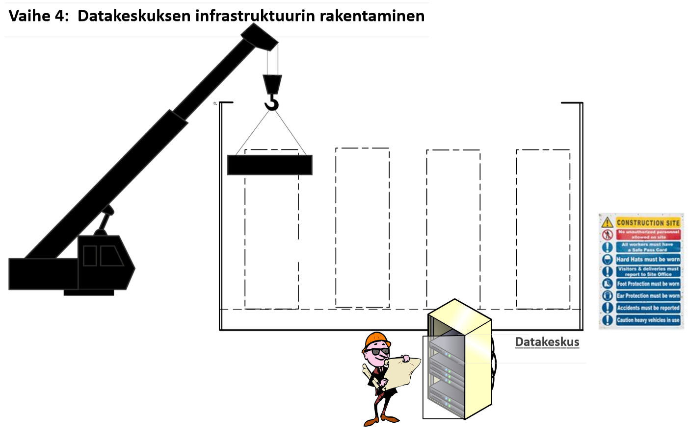
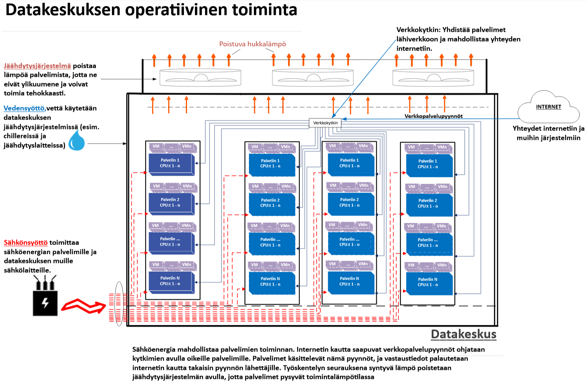
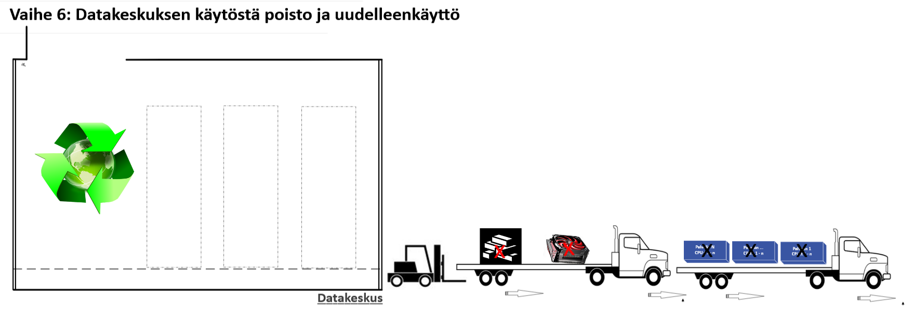

## 2. Datakeskuksen elinkaaren vaiheet

Datakeskuksen elinkaari muodostuu kuudesta päävaiheesta, jotka kattavat koko prosessin tarpeen tunnistamisesta aina käytöstä poistoon ja uudelleenkäyttöön asti.

Klikkaamalla alla olevia otsikoita voit tarkastella kutakin vaihetta erikseen.

---

🔢 Vaihe 1: Tarvekartoitus ja esiselvitys

Tässä tärkeässä alkuvaiheessa laaditaan perusta koko datakeskuksen kehittämiselle. Tarkoitus on luoda kokonaisvaltainen ymmärrys hankkeen toteutettavuudesta ja ympäristövaikutuksista. Vaihe sisältää viisi keskeistä osa-aluetta:

1. **Riskianalyysi** – arvioidaan sekä tekniset (esim. järjestelmien luotettavuus), taloudelliset (budjetointi, ROI) että ympäristöriskit (esim. maaperän tila, sään ääri-ilmiöt).  
2. **Kapasiteetin tarve** – määritellään tarvittava laskentateho ja tallennuskapasiteetti nykytilanteeseen ja tulevaisuuden kasvuun perustuen.  
3. **Sijainnin arviointi** – valinta tehdään energian saatavuuden, yhteyksien, logistiikan ja paikallisen infrastruktuurin pohjalta.  
4. **Kustannus–hyötyanalyysi** – vertaillaan investoinnin kokonaiskustannuksia ja pitkän aikavälin hyötyjä, mukaan lukien ympäristöhyödyt.  
5. **Ympäristövaikutusten arviointi** – selvitetään elinkaaren eri vaiheiden vaikutukset, kuten energiankulutus, vedenkäyttö ja hiilijalanjälki.

Tämä vaihe on keskeinen siksi, että pelkkä operatiivisen energian tarkastelu ei riitä; samalla on välttämätöntä huomioida koko elinkaaren ympäristövaikutukset (UNEP DTU, 2020). Lisäksi käytännön konsultointi– ja feasibility-lähteet, kuten Schneider Electricin dokumentti, painottavat, että huolellinen alkuvaiheen analyysi (kuten tarvekartoitus ja sijainnin valinta) on ratkaiseva kokonaiskustannusten sekä projektin aikataulujen hallinnassa (Schneider Electric, 2015).

**Lähteet:**
- UNEP DTU Partnership. (2020). *Environmental sustainability of data centres: A need for a multi-impact and life-cycle approach*. [Linkki](https://c2e2.unepccc.org/wp-content/uploads/sites/3/2020/02/environmental-sustainability-of-data-centres-a-need-for-a-multi-impact-and-life-cycle-approach-brief-1-uk.pdf?utm_source=chatgpt.com)  
- Schneider Electric – Data Center Science Center. (2015). *Fundamentals of Managing the Data Center Life Cycle for Owners*. [Linkki](https://www.insight.com/content/dam/insight-web/en_US/article-images/whitepapers/partner-whitepapers/fundamentals-of-managing-the-data-center-life-cycle-for-owners.pdf?utm_source=chatgpt.com)  

---

🛠️ Vaihe 2: Suunnittelu

Datakeskuksen suunnitteluvaiheessa tehdään ratkaisevat valinnat, jotka vaikuttavat sekä energiatehokkuuteen että pitkän aikavälin ympäristövaikutuksiin. Kuvastoon on koottu keskeisiä teemoja:

- **Energiatehokkuus** – PUE eli Power Usage Effectiveness on keskeinen mittari, joka kuvaa, kuinka paljon energiaa kuluu IT-laitteiden lisäksi jäähdytykseen ja muuhun infrastruktuuriin. Mitä lähempänä arvo on 1, sitä parempi.  
- **Uusiutuva energia ja hukkalämmön talteenotto** – Suunnittelussa kannattaa huomioida mahdollisuudet käyttää aurinko-, tuuli- tai hukkalämpöenergiaa, mikä vähentää operatiivisia päästöjä ja energian kokonaiskulutusta.  
- **Moniammatillinen tiimityö ja simulointi** – Monialainen yhteistyö (insinöörit, ympäristöasiantuntijat, IT-suunnittelijat) sekä simulointimallit (esim. airflow, energiajärjestelmät) mahdollistavat optimoidut ratkaisut.  
- **Kiertotalous ja elinkaari** – Suunnittelun tulisi huomioida elinkaariajattelu: komponenttien kierrätettävyys, modulaarisuus ja tulevat päivitysmahdollisuudet.

Pelkän operatiivisen energiatehokkuuden optimoinnin (kuten alhainen PUE) sijaan suunnittelun tulee ottaa huomioon koko elinkaaren ympäristövaikutukset (Whitehead ym., 2015). Lisäksi parhaat käytännöt (esim. LBNL:n ohjeistus) sisältävät kattavat suositukset ilmastointijärjestelmien, sähkönsyötön, jäähdytyksen ja lämmön talteenoton yhteensovittamisesta energiatehokkuuden parantamiseksi (LBNL, 2025).

**Lähteet:**
- Whitehead, B., Andrews, D., & Shah, A. (2015). *The life cycle assessment of a UK data centre*. *International Journal of Life Cycle Assessment, 20*, 332–349. [Linkki](https://link.springer.com/article/10.1007/s11367-014-0838-7?utm_source=chatgpt.com)  
- Lawrence Berkeley National Laboratory (2025). *Best Practices Guide for Energy-Efficient Data Center Design*. [Linkki](https://datacenters.lbl.gov/sites/default/files/2025-07/best_practice-guide-data-center-design.pdf)

---

⚖️ Vaihe 3: Päätöksenteko ja luvitus

Tässä vaiheessa tehdään datakeskuksen toteutuksen kannalta ratkaisevat päätökset ja varmistetaan, että hankkeen eteneminen täyttää sekä viranomaismääräykset että kestävän kehityksen tavoitteet. Prosessi on luonteeltaan monivaiheinen ja monialainen, ja siihen sisältyy neljä keskeistä osa-aluetta.

1. **EU- ja kansallisen tason sääntelykehys** – Toimintaa ohjaavat EU:n ja kansallisen tason määräykset. Näistä keskeinen on EU:n teollisuuspäästödirektiivi (*Industrial Emissions Directive*, IED), joka määrittää suurten teollisuuslaitosten – mukaan lukien merkittävästi energiaa kuluttavat datakeskukset – vähimmäistasoiset ympäristönsuojeluvaatimukset. Direktiivin tavoitteena on ehkäistä ja vähentää ilman, veden ja maaperän pilaantumista hyödyntämällä parasta käyttökelpoista tekniikkaa (BAT, *Best Available Techniques*). Kansallinen lainsäädäntö ja energiatehokkuusvaatimukset, kuten energiatodistus ja ympäristö-, terveys- ja turvallisuusstandardit (EHS), täydentävät sääntelykehystä.

2. **Lupaprosessi ja päätöksenteko** – Tähän sisältyvät investointipäätökset, sijainti- ja teknologiavalinnat sekä näihin liittyvien lupahakemusten ja viranomaisdokumenttien valmistelu ja toimittaminen. Prosessiin kuuluu myös kaavoituksen koordinointi.

3. **Infrastruktuurin suunnittelu ja sijainnin määrittely** – Kattaa liittymisen sähköverkkoon ja kapasiteettivaatimusten varmistamisen, tietoliikenneyhteyksien toteutuksen sekä maankäytön ja alueellisen suunnittelun reunaehtojen huomioimisen.

4. **Ympäristövastuu ja vaikutusten hallinta** – Sisältää ilmasto- ja luontovaikutusten arvioinnin sekä sidosryhmien, erityisesti paikallisyhteisöjen, osallistamisen suunnitteluprosessiin. Tässä yhteydessä huomioidaan myös ympäristöluvat ja niihin liittyvät rajoitukset, kuten melu-, vesi- ja ilmanlaadun sääntely.

Elinkaarilähtöinen arviointimalli on välttämätön, jotta päätöksenteossa ei rajoituta pelkästään operatiivisten tavoitteiden optimointiin, vaan huomioidaan myös rakentamisen ympäristökuormitus ja päästöjen seuranta (Tozzi, 2025). Käytännön kokemukset osoittavat, että ympäristölupien – esimerkiksi varavoimajärjestelmien käytön tai päästöjen hallinnan – käsittely vaatii tarkkaa ajoitusta, sillä kaavoitus- ja lupaprosessien viivästykset voivat merkittävästi hidastaa hankkeen etenemistä (RPS, 2025).

**Lähteet:**
- Tozzi, C. (2025, kesä 11). *Data Center Life Cycle Assessments: A New Sustainability Standard*. *Data Center Knowledge*. [Linkki](https://www.datacenterknowledge.com/data-center-construction/data-center-life-cycle-assessments-the-new-sustainability-standard?utm_source=chatgpt.com)  
- RPS Group. (2025). *Environmental permitting for data centres: What you need and when to apply*. [Linkki](https://www.rpsgroup.com/insights/consulting-uki/environmental-permitting-for-data-centres-what-you-need-and-when-to-apply)  

---

🏗️ Vaihe 4: Rakentaminen

Rakentamisvaihe merkitsee datakeskuksen elinkaaressa siirtymistä suunnitelmista konkreettiseen toteutukseen. Tässä vaiheessa fyysinen infrastruktuuri luodaan, ja sen valinnat vaikuttavat merkittävästi sekä rakennusvaiheen että koko käyttöiän aikaiseen ympäristökuormitukseen. Rakentamisvaihe voidaan jäsentää neljään pääosa-alueeseen:

1. **Rakennustekniset ratkaisut** – Käsittää datakeskusrakennuksen runkorakenteet, kuormat ja modulaarisuuden. Rakennusmateriaalien valinnalla (esim. vähähiilinen betoni, kierrätetyt teräsrakenteet) voidaan vähentää merkittävästi rakentamisen hiilijalanjälkeä. Elinkaarianalyysit osoittavat, että materiaalivalintojen optimointi voi pienentää sekä valmistuksen että purun aikaisia päästöjä, ja modulaarinen suunnittelu mahdollistaa tilojen joustavan laajentamisen ilman merkittäviä lisärakennustöitä (Vanderbauwhede & Wadenstein, 2025).

2. **Teknisen infrastruktuurin asennus** – Sisältää sähkö- ja jäähdytysjärjestelmien, varavoimalaitteiden, kaapeloinnin sekä IT-räkkien ja konesalivarusteiden asennuksen. Näiden energiatehokkuus ja huollettavuus vaikuttavat pitkän aikavälin operatiivisiin kustannuksiin ja päästöihin (Shehabi ym., 2016).

3. **Työmaan turvallisuus ja aikataulun hallinta** – Rakentaminen edellyttää tiukkojen turvallisuusstandardien noudattamista sekä tarkkaa projektinhallintaa, jotta aikatauluviiveet eivät johda kustannusten ja ympäristövaikutusten kasvuun.

4. **Käyttöönottovaiheen valmistelu** – Sisältää laitteistojen testaukset, järjestelmien validoinnin ja infrastruktuurin optimoinnin ennen operatiivisen toiminnan aloitusta. Tämä vaihe on kriittinen, jotta suunnitellut energiatehokkuus- ja luotettavuustavoitteet voidaan saavuttaa heti käyttöönotosta lähtien (LBNL, 2025).

Rakentamisvaiheen päästöt ja energiankulutus voivat muodostaa huomattavan osuuden koko datakeskuksen elinkaaren ympäristövaikutuksista, erityisesti jos käytetään paljon energiaintensiivisiä materiaaleja ja tekniikoita (Whitehead ym., 2015). Siksi rakennusvaiheen optimointi – esimerkiksi modulaarisen rakentamisen ja uusiomateriaalien avulla – on olennainen osa kestävää datakeskussuunnittelua.

**Lähteet:**
- Vanderbauwhede, W., & Wadenstein, M. (2025). Life Cycle Analysis for Emissions of Scientific Computing Centres. arXiv. https://doi.org/10.48550/arXiv.2506.14365
- Shehabi, A., Smith, S., Sartor, D., Brown, R., Herrlin, M., Koomey, J., ... & Lintner, W. (2016). *United States Data Center Energy Usage Report*. Lawrence Berkeley National Laboratory. [Linkki](https://eta.lbl.gov/publications/united-states-data-center-energy)  
- Whitehead, B., Andrews, D., & Shah, A. (2015). *The life cycle assessment of a UK data centre*. *International Journal of Life Cycle Assessment, 20*, 332–349. https://doi.org/10.1007/s11367-014-0838-7  
- Lawrence Berkeley National Laboratory (2025). *Best Practices Guide for Energy-Efficient Data Center Design*. [Linkki](https://datacenters.lbl.gov/sites/default/files/2025-07/best_practice-guide-data-center-design.pdf)

---

🖥️ Vaihe 5: Operatiivinen toiminta

Operatiivinen vaihe muodostaa datakeskuksen elinkaaren pisimmän ja usein ympäristövaikutuksiltaan merkittävimmän ajanjakson. Tässä vaiheessa varmistetaan, että tietojenkäsittelypalvelut toimivat luotettavasti, tehokkaasti ja ympäristön kannalta kestävällä tavalla. Operatiivinen toiminta sisältää seuraavat keskeiset osa-alueet:

1. **Sähkönsyöttö** – Sähköenergia mahdollistaa palvelimien ja muun infrastruktuurin toiminnan. Jatkuva sähkönsyöttö on varmistettu useilla redundanssijärjestelmillä, kuten varavoimakoneilla ja UPS-laitteilla. Sähkönkulutus muodostaa merkittävän osuuden koko elinkaaren hiilijalanjäljestä, mikä korostaa uusiutuvan energian hyödyntämisen ja energiatehokkuuden merkitystä (Shehabi ym., 2016).

2. **Verkko- ja palvelinresurssien hallinta** – Verkkokytkimet yhdistävät palvelimet lähiverkkoon ja internetiin, ohjaten verkon kautta saapuvat palvelupyynnöt oikeille palvelimille. Palvelimet käsittelevät pyynnöt ja palauttavat tulokset internetin kautta takaisin pyynnön lähettäjälle. Resurssien hallinta vaikuttaa sekä palvelun laatuun että energiankulutukseen (Zhang ym., 2021).

3. **Lämmönhallinta ja jäähdytys** – Palvelinten toiminta tuottaa lämpöä, joka on poistettava tehokkaasti jäähdytysjärjestelmien avulla. Näihin kuuluvat ilma- ja vesijäähdytysratkaisut, kuten *chillereitä* ja lämmönvaihtimia. **Chiller** (jäähdytyskone) siirtää lämpöä nesteestä toiseen jäähdyttämällä kiertävää jäähdytysnestettä, jota käytetään palvelinten ja muun IT-infrastruktuurin lämpötilan hallintaan. Lämmönvaihtimet puolestaan mahdollistavat lämpöenergian siirron kahden nesteen tai ilman välillä ilman suoraa kosketusta, mikä tehostaa jäähdytysprosessia ja mahdollistaa esimerkiksi hukkalämmön talteenoton. Veden käyttö jäähdytyksessä on merkittävä kestävyyshaaste erityisesti alueilla, joilla vesivarat ovat rajalliset (Masanet ym., 2020), ja hukkalämmön hyödyntäminen esimerkiksi kaukolämpöverkossa voi merkittävästi vähentää kokonaisympäristökuormitusta (Oró ym., 2015).

4. **Ympäristötehokkuuden seuranta** – Operatiivisessa vaiheessa hyödynnetään mittareita, kuten PUE (Power Usage Effectiveness) ja WUE (Water Usage Effectiveness), joilla seurataan energiankäytön ja vedenkulutuksen tehokkuutta. Näiden mittareiden avulla voidaan optimoida järjestelmiä ja vähentää pitkän aikavälin ympäristövaikutuksia.

Operatiivinen vaihe voi muodostaa yli 80 % datakeskuksen koko elinkaaren energiankulutuksesta (Shehabi ym., 2016), mikä tekee tästä vaiheesta keskeisen kohteen energiatehokkuus- ja päästövähennystoimille. Yhdistämällä uusiutuvan energian käyttö, kehittyneet jäähdytysratkaisut ja jatkuva optimointi voidaan merkittävästi pienentää operatiivisen toiminnan hiilijalanjälkeä.

**Lähteet:**
- Shehabi, A., Smith, S., Sartor, D., Brown, R., Herrlin, M., Koomey, J., ... & Lintner, W. (2016). *United States Data Center Energy Usage Report*. Lawrence Berkeley National Laboratory. [Linkki](https://eta.lbl.gov/publications/united-states-data-center-energy)  
- Masanet, E., Shehabi, A., Lei, N., Smith, S., & Koomey, J. (2020). *Recalibrating global data center energy-use estimates*. *Science, 367*(6481), 984–986. https://doi.org/10.1126/science.aba3758  
- Oró, E., Depoorter, V., Garcia, A., & Salom, J. (2015). *Energy efficiency and renewable energy integration in data centres. Strategies and modelling review*. *Renewable and Sustainable Energy Reviews, 42*, 429–445. https://doi.org/10.1016/j.rser.2014.10.058  
- Zhang, Q., Cheng, L., & Boutaba, R. (2021). *Cloud data centers: Energy efficiency and sustainable design*. *ACM Computing Surveys, 54*(7), 1–36. https://doi.org/10.1145/3453154  

---

♻️ Vaihe 6: Käytöstä poisto ja uudelleenkäyttö

Datakeskuksen elinkaaren viimeisessä vaiheessa infrastruktuuri ja laitteet poistetaan käytöstä hallitusti, ja niiden osat joko kierrätetään, uudelleenkäytetään tai hävitetään ympäristön kannalta turvallisesti. Prosessi sisältää fyysisen infrastruktuurin purkamisen, palvelin- ja tallennuslaitteiden poistamisen, sekä tietoturvallisen datan tuhoamisen, esimerkiksi tallennusmedioiden fyysisen murskauksen avulla.  

Keskeisiä osa-alueita ovat:  
1. **Tietoturvallinen datan poistaminen** – Tallennuslaitteet (esim. HDD, SSD) käsitellään niin, että kaikki asiakas- ja yritysdata tuhoutuu palautumattomasti, mikä voi sisältää ylikirjoituksen, magnetoinnin (degaussing) tai fyysisen tuhoamisen (NIST SP 800-88).  
2. **Komponenttien uudelleenkäyttö ja kierrätys** – Toimintakelpoiset laitteet ja komponentit ohjataan uudelleenkäyttöön; käyttöikänsä päähän tulleet osat kierrätetään materiaalien, kuten kuparin, alumiinin ja harvinaisten maametallien talteenottamiseksi. (Li et al., 2020).  
3. **Ympäristövaikutusten minimointi** – Elektroniikkajätteen käsittelyssä on huomioitava haitallisten aineiden, kuten lyijyn ja elohopean, turvallinen käsittely, jotta vältetään maaperän ja vesistöjen saastuminen (Balde ym., 2017).  
4. **Elinkaaren päättymisen optimointi** – Laitteiden modulaarinen suunnittelu ja standardoidut komponentit voivat helpottaa purkamista ja kierrätystä, vähentäen jätteen määrää ja parantaen resurssitehokkuutta (Deng ym., 2021).

Käytöstä poiston ja uudelleenkäytön vaihe on olennainen osa kiertotalousstrategiaa datakeskusympäristöissä, sillä se mahdollistaa materiaalien ja komponenttien palauttamisen tuotantoketjuun sekä vähentää merkittävästi hiilijalanjälkeä ja luonnonvarojen kulutusta (Balde ym., 2017; Choi ym., 2020).

**Lähteet:**  
- National Institute of Standards and Technology (NIST). (2014). *NIST Special Publication 800-88 Revision 1: Guidelines for Media Sanitization*. [Linkki](https://doi.org/10.6028/NIST.SP.800-88r1)  
- Li, J., Zeng, X., Chen, M., Ogunseitan, O.A. & Stevels, A. (2015). Control-Alt-Delete: rebooting solutions for the e-waste problem. Environmental Science & Technology, 49(12), 7095–7102. https://doi.org/10.1021/es5053009
- Balde, C.P., Forti, V., Gray, V., Kuehr, R., & Stegmann, P. (2017). *The Global E-waste Monitor 2017: Quantities, Flows, and Resources*. United Nations University, International Telecommunication Union, and International Solid Waste Association. [Linkki](https://ewastemonitor.info/)  
- Deng, L., Babbitt, C.W., & Williams, E.D. (2021). Economic-balance hybrid LCA extended with uncertainty analysis: case study of a laptop computer. Journal of Cleaner Production,
Volume 19, Issue 11,2011,Pages 1198-1206,ISSN 0959-6526,https://doi.org/10.1016/j.jclepro.2011.03.004.

