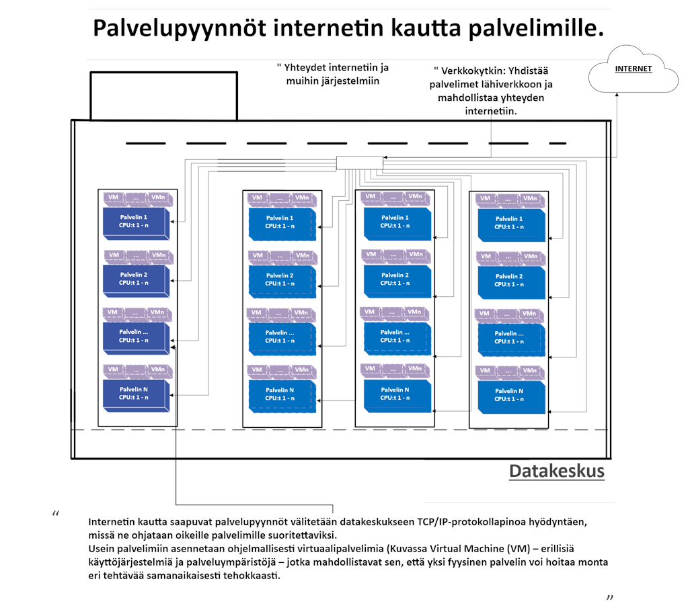

# Datakeskuksen toiminta vaiheittain – sähköstä palveluun ja takaisin lämpönä

## 🔌 1. Sähkönsyöttö ja jäähdytys

Datakeskus ei toimi ilman jatkuvaa sähkönsyöttöä ja toimivaa jäähdytystä.  
Palvelimien toiminta perustuu keskeytymättömään sähköön, ja jäähdytys – usein vesikiertoinen – poistaa syntyvän lämmön.

---

## 🌐 2. Palvelupyynnöt internetistä palvelimille

Käyttäjien verkkopalvelupyynnöt saapuvat internetin kautta datakeskukseen.  
Verkkolaitteet ohjaavat ne oikeille palvelimille, jotka käsittelevät niitä tehokkaasti.

---

## 🖥️ 3. Palvelinten toiminta ja lämmöntuotanto

Palvelimet suorittavat pyydettyjä tehtäviä: laskentaa, tietojen käsittelyä ja tallennusta.  
Tämä kuluttaa merkittävästi sähköä ja tuottaa lämpöä, joka poistetaan jäähdytyksellä.

---

## ⚡ 4. Kokonaissähköenergiankulutus

Datakeskuksen sähkönkulutus jakautuu:

- **Eₛ:** palvelimet
- **Eₛₜ:** tallennuslaitteet
- **Eₚ:** verkkolaitteet
- **Eᵢ:** tukijärjestelmät (jäähdytys, valaistus, UPS)

Yhteensä nämä muodostavat **kokonaissähköenergiankulutuksen**, josta merkittävä osa muuttuu hukkalämmöksi.

---

### 💭 Pohdintatehtävä

> Miksi palvelimet ovat suurin sähkönkuluttaja datakeskuksessa?  
> Entä mitä seurauksia olisi, jos jäähdytys keskeytyisi?

