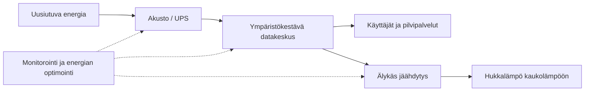

# Datakeskuksen dokumentaatio

Tämä dokumentti kuvaa datakeskuksen rakenteen, toiminnan, ohjauksen, ylläpidon ja ympäristökestävyyden keskeiset osa-alueet. Dokumentti soveltuu GitHub-repon `docs/`-hakemistoon tekniseksi perusdokumentiksi, jota voidaan täydentää arkkitehtuuri-, mittaus-, käyttö- ja turvallisuusdokumenteilla.

## Sisällysluettelo

* [1. Tarkoitus ja soveltamisala](#1-tarkoitus-ja-soveltamisala)
* [2. Datakeskuksen yleiskuvaus](#2-datakeskuksen-yleiskuvaus)
* [3. Pääjärjestelmät](#3-pääjärjestelmät)
* [4. Sähkönsyöttö ja energianhallinta](#4-sähkönsyöttö-ja-energianhallinta)
* [5. IT-kuorma ja kapasiteetti](#5-it-kuorma-ja-kapasiteetti)
* [6. Jäähdytys ja lämpökuorman hallinta](#6-jäähdytys-ja-lämpökuorman-hallinta)
* [7. Hukkalämmön hyödyntäminen](#7-hukkalämmön-hyödyntäminen)
* [8. Monitorointi, automaatio ja ohjaus](#8-monitorointi-automaatio-ja-ohjaus)
* [9. Tietoturva ja fyysinen turvallisuus](#9-tietoturva-ja-fyysinen-turvallisuus)
* [10. Käyttö, ylläpito ja vastuut](#10-käyttö-ylläpito-ja-vastuut)
* [11. Häiriötilanteet ja jatkuvuuden hallinta](#11-häiriötilanteet-ja-jatkuvuuden-hallinta)
* [12. Ympäristökestävyys ja tunnusluvut](#12-ympäristökestävyys-ja-tunnusluvut)
* [13. Muutoshallinta](#13-muutoshallinta)
* [14. Suositeltu hakemistorakenne GitHub-repossa](#14-suositeltu-hakemistorakenne-github-repossa)
* [15. Tarkistuslista](#15-tarkistuslista)

## 1. Tarkoitus ja soveltamisala

Tämän dokumentaation tavoitteena on:

* kuvata datakeskuksen tekninen kokonaisuus selkeästi
* määrittää pääjärjestelmät, niiden vastuut ja rajapinnat
* tukea käyttöä, ylläpitoa, valvontaa ja jatkuvaa parantamista
* dokumentoida energian, jäähdytyksen ja kuormituksen hallinta
* tukea ympäristökestävyyden arviointia ja raportointia

Soveltamisala kattaa datakeskuksen fyysisen infrastruktuurin, sähköjärjestelmät, IT-kuorman, jäähdytyksen, verkot, tietoturvan, valvonnan, ohjauksen, mittauksen, häiriötilanteiden hallinnan sekä kestävyyteen liittyvät tunnusluvut.

## 2. Datakeskuksen yleiskuvaus

Datakeskus on palvelin- ja tietoliikenneinfrastruktuuriin perustuva toimintaympäristö, jonka tehtävänä on tarjota laskenta-, tallennus- ja verkkopalveluita hallitusti, turvallisesti ja energiatehokkaasti. Datakeskus koostuu useista toisiinsa liittyvistä alijärjestelmistä, joiden toiminta on riippuvaista jatkuvasta sähkönsyötöstä, jäähdytyksestä, ohjauksesta ja valvonnasta.

Ympäristökestävässä datakeskuksessa tekniset ratkaisut pyritään suunnittelemaan siten, että energiankulutus, päästöt, jäähdytyksen tarve ja resurssihävikki minimoidaan kuitenkaan vaarantamatta käytettävyyttä, turvallisuutta tai palvelutasoa.

## 3. Pääjärjestelmät

### 3.1 IT-järjestelmä

IT-järjestelmä sisältää palvelimet, tallennusjärjestelmät, verkkolaitteet, virtualisointiympäristöt ja mahdolliset alustapalvelut. Tämä kerros tuottaa varsinaisen laskenta- ja tietojenkäsittelykapasiteetin.

### 3.2 Sähköjärjestelmä

Sähköjärjestelmä sisältää verkkoliitynnän, muuntajat, UPS-järjestelmät, akustot, varavoiman, jakelukeskukset ja syöttöreitit. Järjestelmän tehtävänä on taata keskeytymätön ja laadukas sähkönsyöttö IT-kuormalle ja tukijärjestelmille.

### 3.3 Jäähdytysjärjestelmä

Jäähdytysjärjestelmä vastaa IT-laitteiden ja teknisten tilojen lämpökuorman poistamisesta. Se voi koostua esimerkiksi vapaajäähdytyksestä, mekaanisesta jäähdytyksestä, nestejäähdytyksestä, puhallinjärjestelmistä, pumppauksesta ja lämmönsiirtimistä.

### 3.4 Valvonta- ja ohjausjärjestelmä

Valvonta- ja ohjausjärjestelmä sisältää mittauksen, hälytykset, automaation, käyttöliittymät, lokitiedot, analytiikan ja optimointilogiikan. Sen tehtävä on ylläpitää käyttövarmuutta, havaita poikkeamat ja tukea energiatehokasta käyttöä.

### 3.5 Turvallisuusjärjestelmät

Turvallisuus kattaa fyysisen turvallisuuden, paloturvallisuuden, kulunvalvonnan, kameravalvonnan, kyberturvallisuuden ja varautumisen häiriö- sekä poikkeustilanteisiin.

## 4. Sähkönsyöttö ja energianhallinta

Datakeskuksen toiminta edellyttää jatkuvaa ja laadukasta sähkönsaantia. Tässä osassa kuvataan:

* sähkönsyötön lähteet
* verkon kapasiteetti ja redundanssi
* UPS-ratkaisut ja akustojen mitoitus
* varavoima ja sen käyttötapaukset
* jakelureitit ja kriittiset kuormat
* sähköhäviöt ja hyötysuhteet

Ympäristökestävyyden näkökulmasta dokumentoidaan lisäksi:

* uusiutuvan energian käyttö
* energiavarastojen rooli
* kuormansiirto ja kulutusjousto
* mahdollinen sähkön hiili-intensiteettiin perustuva ohjaus

## 5. IT-kuorma ja kapasiteetti

IT-kuorma muodostuu palvelimista, tallennuksesta ja verkkolaitteista. Dokumentaatiossa kuvataan:

* palvelin- ja laitemäärät
* rack-kohtainen kapasiteetti
* tehotiheys ja kuormitusaste
* virtualisointi- ja klusteriratkaisut
* kapasiteetin kasvupolku
* kriittiset palvelut ja niiden prioriteetit

Kapasiteettidokumentaatio tukee sekä investointipäätöksiä että energianhallintaa. Erityisen tärkeää on ymmärtää IT-kuorman vaihtelu ajan, käyttäjäkuorman ja sovellusten mukaan.

## 6. Jäähdytys ja lämpökuorman hallinta

Jäähdytys on datakeskuksen suurimpia tukitoimintoja energiankulutuksen näkökulmasta. Tässä osassa kuvataan:

* käytettävä jäähdytystekniikka
* jäähdytyksen kapasiteetti
* lämpötila- ja kosteusrajat
* ilman tai nesteen kierto
* kylmä- ja kuumakäytäväratkaisut
* ohjauslogiikka ja asetusarvot
* osakuormakäyttäytyminen
* redundanssi ja vikatilanteet

Mikäli käytössä on älykäs jäähdytysohjaus, dokumentoidaan myös, millä mittaustiedoilla ohjausta tehdään ja miten energiatehokkuutta optimoidaan ilman, että laitteiden toimintavarmuus vaarantuu.

## 7. Hukkalämmön hyödyntäminen

Ympäristökestävän datakeskuksen dokumentaatioon kuuluu myös hukkalämmön hyödyntämisen arviointi. Tässä osassa dokumentoidaan:

* hukkalämmön lähteet
* lämpötilatasot
* talteenottoratkaisut
* liityntämahdollisuudet kiinteistöihin tai kaukolämpöön
* vuosittainen hyödynnettävän lämmön määrä
* tekniset ja taloudelliset rajoitteet

Hukkalämmön hyödyntäminen on tapa nostaa datakeskuksen kokonaishyötysuhdetta ja parantaa järjestelmän resurssitehokkuutta.

## 8. Monitorointi, automaatio ja ohjaus

Datakeskus on toiminnallisesti monimutkainen kokonaisuus, minkä vuoksi monitorointi ja ohjaus on dokumentoitava huolellisesti. Tässä osassa kuvataan:

* mitattavat suureet, kuten teho, energia, lämpötila, kosteus, virtaus, käyttöaste ja hälytykset
* mittauspisteiden sijainnit
* käytettävät valvontajärjestelmät
* automaatiosäännöt ja ohjauslogiikat
* hälytysrajat
* raportointi ja lokitus
* käyttöhenkilöstön vastuut

Seuraava kaavio havainnollistaa datakeskuksen pääjärjestelmiä ja niiden suhteita:



## 9. Tietoturva ja fyysinen turvallisuus

Tietoturvadokumentaatiossa käsitellään vähintään:

* käyttöoikeuksien hallinta
* verkkosegmentointi
* päivitys- ja haavoittuvuushallinta
* lokien säilytys ja valvonta
* varmistukset ja palautusmenettelyt
* poikkeamien käsittely

Fyysisen turvallisuuden osalta dokumentoidaan:

* kulunvalvonta
* kameravalvonta
* palo- ja sammutusjärjestelmät
* laitetilojen suojaus
* kävijä- ja huoltokäytännöt

## 10. Käyttö, ylläpito ja vastuut

Dokumentaatiossa määritellään roolit ja vastuut. Tyypillisiä vastuutahoja ovat:

* datakeskuksen omistaja tai vastuuyksikkö
* käyttö- ja ylläpitohenkilöstö
* sähköjärjestelmien ylläpito
* jäähdytysjärjestelmien ylläpito
* tietoturvavastaavat
* palveluomistajat
* ulkoiset kumppanit ja huolto-organisaatiot

Lisäksi dokumentoidaan säännölliset tarkastukset, huolto-ohjelmat, varmistukset, testaukset ja hyväksymismenettelyt.

## 11. Häiriötilanteet ja jatkuvuuden hallinta

Datakeskuksen dokumentaation tulee kattaa myös häiriö- ja poikkeustilanteet. Näitä ovat esimerkiksi:

* sähkökatkot
* UPS-vika tai akuston kapasiteetin heikkeneminen
* jäähdytyksen häiriö
* verkkoyhteyksien katkeaminen
* kyberturvallisuuspoikkeama
* laitetilan lämpötilan nousu
* vesivuoto tai palotilanne

Jokaisesta häiriötilanteesta tulee kuvata tunnistaminen, vastuuhenkilöt, toimenpiteet, palautuminen ja jälkikäteinen analyysi.

## 12. Ympäristökestävyys ja tunnusluvut

Ympäristökestävän datakeskuksen dokumentaatioon kannattaa sisällyttää vähintään seuraavat tunnusluvut:

| Tunnusluku                    | Kuvaus                                   |
| ----------------------------- | ---------------------------------------- |
| Energiankulutus vuodessa      | Kokonaiskulutus kWh tai MWh              |
| IT-kuorman osuus              | IT-laitteiden osuus kokonaiskulutuksesta |
| PUE                           | Power Usage Effectiveness                |
| Uusiutuvan energian osuus     | Prosenttiosuus käytetystä energiasta     |
| Arvioidut tai mitatut päästöt | CO2e-pohjainen arvio tai mittaus         |
| Jäähdytyksen energiankulutus  | Jäähdytysjärjestelmän kulutus            |
| Hukkalämmön hyödyntämisaste   | Talteen otetun lämmön osuus              |
| Vedenkulutus                  | Tarvittaessa ilmoitettava lisämittari    |

Näiden tunnuslukujen avulla datakeskuksen kehitystä voidaan seurata systemaattisesti.

## 13. Muutoshallinta

Datakeskuksen dokumentaatio ei ole staattinen. Siksi on määriteltävä:

* kuka päivittää dokumentaatiota
* milloin dokumentaatio tarkistetaan
* miten muutokset hyväksytään
* miten versiot hallitaan
* missä dokumentaatio säilytetään

Suositus GitHub-repossa:

* käytä pull request -käsittelyä dokumentaatiomuutoksille
* nimeä kuvat ja liitteet yhdenmukaisesti
* pidä tekniset kuvat `docs/img/`-hakemistossa
* lisää merkittävät rakenteelliset muutokset muutoslokiin

## 14. Suositeltu hakemistorakenne GitHub-repossa

```text
repo/
├─ README.md
├─ docs/
│  ├─ datakeskuksen-dokumentaatio.md
│  ├─ arkkitehtuuri.md
│  ├─ energianhallinta.md
│  ├─ jaahdytys.md
│  ├─ turvallisuus.md
│  ├─ operointi-ja-yllapito.md
│  ├─ jatkuvuudenhallinta.md
│  ├─ kestavyysmittarit.md
│  └─ img/
│     ├─ datakeskus-kaavio.png
│     ├─ uml-datakeskusmalli.png
│     └─ mittauspisteet.png
└─ CHANGELOG.md
```

## 15. Tarkistuslista

Datakeskuksen dokumentaation vähimmäissisältö:

* [ ] tarkoitus ja soveltamisala
* [ ] yleiskuvaus ja arkkitehtuuri
* [ ] sähköjärjestelmät
* [ ] IT-kuorma ja kapasiteetti
* [ ] jäähdytys
* [ ] monitorointi ja ohjaus
* [ ] turvallisuus
* [ ] käyttö ja ylläpito
* [ ] häiriötilanteet
* [ ] ympäristökestävyysmittarit
* [ ] muutoshallinta

---

## Muistiinpanot jatkokehitystä varten

Tätä dokumenttia voidaan laajentaa repo- ja organisaatiokohtaisesti lisäämällä:

* yksityiskohtainen arkkitehtuurikaavio
* UML-luokkakaavio tai järjestelmäkaavio
* mittauspistekartta
* PUE/CUE/WUE-raportointimalli
* vastuumatriisi
* käyttöönottotarkistuslista
* varautumis- ja palautumismenettelyt
