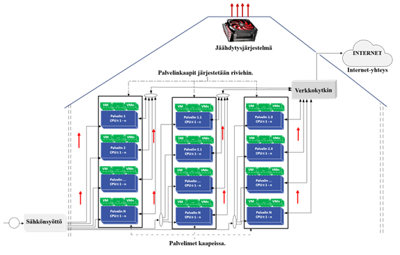
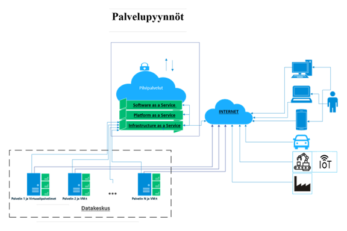

# P1 – Johdanto vihreään datakeskukseen

Tavoite: selittää lyhyesti, mikä datakeskus on, miksi niistä puhutaan ja mitä vihreys tarkoittaa.

## P1.1 Datakeskus ja sen rooli

Datakeskus on fyysinen laitos, joka sisältää verkotettuja tietokoneita ja laitteita, kuten palvelimia, tallennusjärjestelmiä, reitittimiä ja kytkimiä ja jossa säilytetään, käsitellään ja jaetaan suuria määriä dataa (Kuva 1). Ne toimivat IT-sektorin keskeisenä infrastruktuurina päätehtävänään varmistaa yritysten ja organisaatioiden tärkeiden sovellusten ja tietojen jatkuva saatavuus ja tietoturva [1].

Datakeskusten keskeisin tekninen infrastruktuuri koostuu sähkönjakelujärjestelmästä, mukaan lukien sähkönsyöttö, keskeytymätön virtalähde (UPS) ja varavoimajärjestelmät (esim. dieselgeneraattorit), jotka yhdessä takaavat jatkuvan sähkönsaannin ilman katkoksia, jäähdytysjärjestelmistä ja automaatiojärjestelmistä. Datakeskuksen tuotantoprosessin ydinalue on tietotekniikkajärjestelmäalue, jossa sijaitsevat laitekaapit ja palvelimet. 

  

*Kuva 1. Datakeskuksen infrastruktuuri sisältää sähkönsyötön, jäähdytysjärjestelmän, verkkoyhteydet ja palvelimet.*

Sähkönsyöttö on kriittinen tekijä datakeskusten infrastruktuurin jatkuvan toiminnan takaamiseksi. Suomessa uudet teollisen mittakaavan datakeskukset on kytketty valtakunnallisen sähköverkko-operaattori Fingrid:in sähköverkkoon, joka vastaa sähköenergian siirrosta ja sähköverkon tasapainon ylläpidosta. 

Datakeskukset mahdollistavat yritysten ja organisaatioiden digitaalisten palveluiden jatkuvan saatavuuden, käsitellen valtavia määriä “palvelupyyntöjä” käyttäjiltä ja sovelluksilta ympäri vuorokauden internetin kautta [Google 1]. 

## P1.2 Palvelupyyntö esimerkkinä toiminnasta

Palvelupyyntö (engl. *request*) tarkoittaa verkkopalveluiden käyttäjiltä tai sovelluksista datakeskukseen saapuvia pyyntöjä, kuten verkkosivujen lataamista, tietokantakyselyitä, tiedostojen lataamista tai muiden verkkopalveluiden hyödyntämistä (Kuva 2).

  

*Kuva 2. Palvelupyyntöjen reitti käyttäjiltä datakeskukseen: pyynnöt eri laitteista kulkevat internetin kautta pilvipalveluihin tai suoraan datakeskukseen, jossa ne käsitellään ja välitetään tarvittaville resursseille.*

## P1.3 Digitalisaatio, energiankulutus ja ympäristöhaaste

Digitalisaation kasvu on tehnyt datakeskuksista modernin infrastruktuurin keskeisen osan, mikä on johtanut niiden määrän ja energiankulutuksen nopeaan kasvuun. Ilmastonmuutoksen torjumiseksi ja kestävän kehityksen saavuttamiseksi on entistä tärkeämpää suunnitella energiatehokkaita ja ympäristöystävällisiä toimintamalleja. 

Tämä opas tarjoaa kokonaisvaltaisen lähestymistavan vihreän datakeskuksen suunnitteluun keskittyen uusiutuviin energialähteisiin, energiatehokkaisiin teknologioihin ja kestäviin toimintamalleihin.

Oppaassa käsitellään muun muassa seuraavia kysymyksiä:

- Miten vähentää energiankulutuksesta johtuvia päästöjä?
- Kuinka uusiutuvat energialähteet, kuten aurinko- ja tuulivoima, integroidaan datakeskusten energiantuotantoon?
- Mitkä teknologiat parantavat energiatehokkuutta sähkönsyötössä, jäähdytyksessä ja laitteistossa?
- Miten tekoäly ja data-analytiikka tukevat energiankulutuksen reaaliaikaista hallintaa?

## P1.4 Mitä vihreä datakeskus tavoittelee. 

Vihreä datakeskus on suunniteltu siten, että sen mekaaniset, sähköiset ja tietojärjestelmät on optimoitu yhdessä maksimaalisen energiatehokkuuden ja vähäisen ympäristövaikutuksen saavuttamiseksi (Gowri, 2005).

P1.4 Vihreän datakeskuksen tutkimuspohjainen määritelmä ja tavoitteet

Tutkimuskirjallisuudessa vihreällä datakeskuksella tarkoitetaan kokonaisuutta, jossa rakennus, sähkönsyöttö, jäähdytys, IT-laitteet ja ohjausjärjestelmät suunnitellaan ja mitoitetaan yhdessä siten, että energiankulutus ja ympäristövaikutukset minimoidaan koko elinkaaren ajan. Tavoitteena ei ole ainoastaan pienentää yksittäisten laitteiden sähkönkulutusta, vaan optimoida koko energiaketju sähkön hankinnasta IT-kuormaan, jäähdytykseen ja hukkalämmön hyödyntämiseen sekä kiertotalouteen perustuvaan materiaalinhallintaan [4]Manganelli ym. 2021. Vihreä datakeskus nähdään siten osana laajempaa energiajärjestelmää, ei erillisenä “sähkönkuluttajana”.

Keskeistä vihreässä datakeskuksessa on energiatehokkuuden, energiamixin ja energian uudelleenkäytön yhteistarkastelu. Tutkimusten mukaan datakeskusten kestävyyttä voidaan parantaa samanaikaisesti kolmella tavalla: 1) pienentämällä kokonaisenergiankulutusta tehokkaiden laitteiden, jäähdytysratkaisujen ja kuormanhallinnan avulla, 2) lisäämällä vähäpäästöisen ja uusiutuvan energian osuutta sähköntuotannossa sekä 3) hyödyntämällä mahdollisimman suuri osa syntyvästä hukkalämmöstä esimerkiksi kaukolämpöjärjestelmissä [4]. EN 50600-4 -standardisarja täydentää tätä näkökulmaa määrittelemällä mittareita (kuten PUE, WUE, CUE ja ERF/REF), joiden avulla datakeskuksen energiatehokkuutta, veden käyttöä, hiilijalanjälkeä ja energian uudelleenkäyttöä voidaan mitata ja vertailla järjestelmällisesti [21] EN 50600-4.

Tässä oppaassa vihreällä datakeskuksella tarkoitetaan näihin tutkimus- ja standardiviitekehyksiin perustuvaa datakeskusta, joka:
käyttää mahdollisimman vähän energiaa suhteessa tarjoamiinsa palveluihin,
hankkii sähkönsä ensisijaisesti vähäpäästöisistä ja uusiutuvista lähteistä,
suunnittelee jäähdytyksen ja hukkalämmön talteenoton osaksi paikallista energiaekosysteemiä,
minimoi vedenkulutuksen ja materiaalien ympäristökuorman sekä
tukee kiertotaloutta laitteiden pitkäikäisyyden, päivitettävyyden ja kierrätettävyyden kautta.
Seuraavissa luvuissa tätä määritelmää avataan käytännön ratkaisujen kautta: ensin sijainnin ja perusratkaisujen tasolla (P2–P3), sitten energiavirran ja hukkalämmön näkökulmasta (P5–P6) sekä lopuksi standardien, mittarien ja sääntelyn tasolla (P7).

### P1.10 Etenemisjärjestys: tarpeesta suunnitteludokumentteihin

Tässä perusoppaassa vihreän datakeskuksen suunnittelu etenee vaiheittain siten, että varhaiset päätökset tuottavat seuraavan vaiheen lähtötiedot. Tarkoitus ei ole valita teknisiä ratkaisuja irrallisesti, vaan lukita ensin tarve, koko, tyyppi ja sijainti, jotta energianhankinta, hukkalämpö, jäähdytys, sähköjärjestelmä ja mittaus voidaan suunnitella yhtenä kokonaisuutena.

#### 1. Tarve

Ensin määritetään, miksi datakeskus rakennetaan. Tässä vaiheessa päätetään myös, onko kyse omasta datakeskuksesta, colocation-ratkaisusta, pilvestä vai hybridimallista. Tarve määrittää myöhemmät painotukset: viive, kapasiteetti, käytettävyys, energiatehokkuus, hukkalämpö ja kustannusrakenne.

**Tuotos:** hankkeen perustelu, käyttötarkoitus, toteutusmalli ja palvelutasotavoite.

#### 2. Koko ja tyyppi

Kun tarve on määritetty, arvioidaan datakeskuksen koko ja tyyppi. Tässä vaiheessa kuvataan työkuorma `L(t)`, palvelutasovaatimukset (SLA/SLO), kapasiteetin tarve sekä se, onko ratkaisu esimerkiksi edge-, enterprise-, pilvi-, HPC- tai AI-painotteinen.

Tavoitteena on johtaa kuormasta kapasiteettitarve ja siitä edelleen IT-tehoprofiili. Tässä vaiheessa ei vielä valita lopullista jäähdytys- tai sähköarkkitehtuuria, vaan muodostetaan niiden mitoituksen lähtötieto.

**Tuotos:** kuormakuvaus `L(t)`, kapasiteettiarvio, palvelutasorajat ja alustava IT-tehoprofiili `P_IT(t)`.

#### 3. Sijainti

Sijainti valitaan vasta, kun tarve, koko ja tyyppi ovat tiedossa. Sijainti määrittää sähköliittymän realistiset vaihtoehdot, verkko- ja viivereunaehdot, uusiutuvan energian hankinnan mahdollisuudet, free cooling -potentiaalin sekä hukkalämmön hyödyntämisen edellytykset.

Sijainti ei ole vain tonttikysymys, vaan energian, liityntöjen ja liiketoimintalogiikan päätös. Tästä syystä se käsitellään ennen varsinaisia teknisiä ratkaisujen valintoja.

**Tuotos:** sijaintipäätös tai sijaintivertailu, jossa on kuvattu sähkö, verkot, liitynnät, free cooling -potentiaali ja hukkalämmön vastaanottajavaihtoehdot.

#### 4. Hukkalämpö osaksi liiketoimintaa

Hukkalämpö arvioidaan jo alkuvaiheessa osana liiketoimintaa, ei vasta teknisenä lisäominaisuutena. Tässä vaiheessa selvitetään, onko kohteella realistinen lämpönielu, kuten kaukolämpöverkko, teollinen vastaanottaja tai muu paikallinen käyttö.

Arvioinnissa tarkastellaan ainakin:
- toimitettavissa oleva lämpöteho ja lämpöenergia
- lämpötilataso
- vastaanottajan sijainti ja liityntäetäisyys
- lämpöpumpun tai muun lämpötilanoston tarve
- sopimus- ja vastuunjakomalli.

Jos hukkalämmön hyödyntäminen on mahdollista, se vaikuttaa jo sijaintiin, järjestelmäarkkitehtuuriin, mitoitukseen ja liiketoimintamalliin.

**Tuotos:** hukkalämmön esiselvitys, rajapintakuvaus, alustava kannattavuus- ja toteutettavuusarvio.

#### 5. Uusiutuvan energian hankinta mukaan heti alkuvaiheessa

Samassa vaiheessa määritetään sähkön hankinnan periaate. Vaihtoehtoja voivat olla esimerkiksi:
- PPA
- oma tuotanto
- alkuperätakuut
- muu todennettava hankintamalli
- näiden yhdistelmä.

Tarkoitus on lukita jo alkuvaiheessa, miten sähkön alkuperä todennetaan ja millä päästökertoimilla käyttöaikaiset päästöt raportoidaan. Tämä ei ole vain raportointikysymys, vaan osa datakeskuksen perusratkaisua.

**Tuotos:** energianhankinnan periaate, todentamistapa ja raportoinnin lähtötiedot.

#### 6. Jos hukkalämpöä tai vahvaa uusiutuvan energian ratkaisua ei saada, free cooling korostuu

Jos sijainnissa ei ole realistista hukkalämmön vastaanottajaa tai uusiutuvan energian hankintaratkaisu jää heikoksi, free cooling nousee keskeiseksi suunnitteluperiaatteeksi. Suomessa tämä on usein luonteva vaihtoehto ilmasto-olosuhteiden vuoksi.

Tässä vaiheessa arvioidaan:
- free cooling -potentiaali
- ulkolämpötilajakauman vaikutus
- valittavan jäähdytysarkkitehtuurin toimintaperiaate
- veden, ilman ja olosuhteiden vaikutus käyttöön
- vaikutus energiankulutukseen ja käyttökustannuksiin.

**Tuotos:** jäähdytysstrategian päälinja ja arvio siitä, missä määrin free cooling toimii kohteessa.

#### 7. Mitoitus

Kun tarve, koko, tyyppi, sijainti, hukkalämpö, sähkön hankinta ja jäähdytysstrategia on määritetty, voidaan tehdä varsinainen mitoitus.

Mitoituksessa johdetaan:
`L(t)` + SLA/SLO → `C_act(t)` + `C_res` → `P_IT(t)` → sähkö- ja jäähdytysinfrastruktuurin mitoitus.

Tässä vaiheessa tiedetään jo riittävästi, jotta voidaan arvioida:
- sähköliittymä ja jakelu
- UPS / varavoima / varmistusperiaate
- jäähdytysteho ja lämpökuorma
- mahdollinen hukkalämmön toimituskapasiteetti
- infrastruktuurin osakuorma- ja hyötysuhdekäyttäytyminen.

**Tuotos:** sähkö- ja jäähdytysjärjestelmän mitoituksen lähtötiedot sekä alustava mitoitusratkaisu.

#### 8. Mittausrajat suunnittelussa, ei jälkikäteen

Mittausrajat määritetään suunnitteluvaiheessa samaan aikaan energian, jäähdytyksen ja hukkalämmön ratkaisujen kanssa. Tällöin voidaan päättää:
- mistä kokonaisenergia mitataan
- mistä IT-energia mitataan
- miten jäähdytyksen sähkö erotellaan
- miten hukkalämmön toimitettu energia todennetaan
- millä laskentasäännöillä KPI:t muodostetaan.

Mittausrajat vaikuttavat suoraan siihen, ovatko PUE-, REF-, ERF-, CER-, CUE- ja WUE-lukuja koskevat raportit vertailukelpoisia ja käyttökelpoisia.

**Tuotos:** mittausrajakuvaukset, mittauspistekartta, KPI-määrittelyt ja raportointisäännöt.

#### 9. Suunnitteludokumentit

Edellisten vaiheiden tuloksena syntyvät suunnitteludokumentit, joilla hanke voidaan viedä tekniseen suunnitteluun, hankintaan ja toteutukseen.

Näitä ovat vähintään:
- tarve- ja toteutusmallikuvaus
- kuormakuvaus ja palvelutasorajat
- kapasiteetti- ja IT-tehoprofiili
- sijaintiselvitys ja liityntäehdot
- uusiutuvan energian hankintamalli
- hukkalämmön rajapinta ja alustava liiketoimintamalli
- jäähdytysstrategia
- sähköjärjestelmän mitoituksen lähtötiedot
- mittausrajat, mittauspisteet ja KPI-laskentasäännöt.

Näin vihreä datakeskus etenee tarpeesta mitoitukseen ja edelleen toteutukseen ilman, että energianhankinta, hukkalämpö, jäähdytys ja mittaus jäävät irrallisiksi lisäosiksi.

